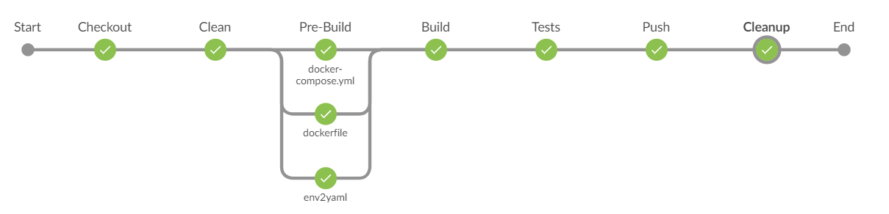
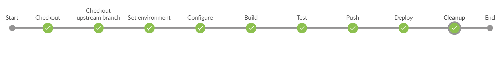

# Jenkins CI and CD pipelines for Logstash

## Overview

A case study of Jenkins pipelines that provides custom Logstash images based on enriched public repository. For the purpose of the demo, multiple Logstash services will be deployed in a Docker Swarm that is set above a set of local VirtualBox VMs.


```bash
+-Host--------------------------------------+
| +-Manager VM----+                         |
| |               |                         |
| |*Jwnkins Master|                         |
| |*Swarm Manager |                         |
| +-----+---------+                         |
|       |                                   |
|       +------------+-------------+        |
|       |            |             |        |
|       v            v             v        |
| +-Worker1----+-Worker2------+-Worker3---+ |
| |            |              |           | |
| |*Builder    |*nonprod ENV  |*prod ENV  | |
| +---------------------------------------+ |
+-------------------------------------------+
```


### CI



The official [logstash-docker](https://github.com/elastic/logstash-docker) repository is built with [Travis](https://travis-ci.org/). Jenkins adaptation of build procedures allows achieving several goals:

1. Understanding and control over the content of the build image and (better than using a public one)
2. Parallelizing some steps
3. Using pre-set and stable building environment (helpers)

### CD



Adding continuous deployment pipeline with properly versioned configuration allows fast, stable and transparent deployment.  Custom images having most of the configuration built-it. This will allow further signing that will provide high integrity for those images. Secrets and rapidly changing parameters may be provided via service parameters and Swarm.

CD pipeline simulates continuous work in development, staging and production environments. 
For example '[experimantal](https://github.com/guatemala-city/logstash-docker-swarm/tree/nonprod/experimental)' branch suffix is used for pipeline development, where 'nonprod' and 'pord' prefixes associated with mentioned environments and triggering service deployment constrains. 

[Portainer](https://portainer.io/) [instance](http://192.168.10.2:9000/#/services) allows easy logs access, observation of deployment and update processes.

## List of repositories

| Link                                                         | Description                                         |
| ------------------------------------------------------------ | --------------------------------------------------- |
| [Infra](https://github.com/guatemala-city/Infra)             | Vagrant based infrastructure and documentation `*`  |
| [logstash-docker-swarm](https://github.com/guatemala-city/logstash-docker-swarm) | Jenkins CD pipeline `**`                            |
| [logstash-docker](https://github.com/guatemala-city/logstash-docker) | Fork of a public repo with Jenkins CI pipeline `**` |
| [go-helper-docker](https://github.com/guatemala-city/go-helper-docker) | Golang image for CI environment                     |
| [python-helper-docker](https://github.com/guatemala-city/python-helper-docker) | Python image for CI and CD environments             |


## Prerequisites

Prerequisites for Windows users (restart maybe required):

1. Install latest VirtualBox version  - [link](https://www.virtualbox.org/wiki/Downloads)
   Make sure that virtualization is enabled in BIOS

2. Install VirtualBox Extension Pack – [link](https://www.virtualbox.org/wiki/Downloads)

3. Add VirtualBox folder from Program Files to [PATH](http://www.computerhope.com/issues/ch000549.htm) environmental variable (example: C:\ProgramFiles\Oracle\VirtualBox)

4. Install Vagrant – [link](http://www.vagrantup.com/downloads.html) (the installation path should not contain spaces)

5. Install Git - [link](https://git-for-windows.github.io/)

6. Install SSH client of your choice 

   ​

Prerequisites for Debian users:

1. $ sudo apt-get install virtualbox virtualbox-dkms git vagrant 

## Jenkins

Pre-configured Jenkins instance was used to create all components of this demo. `jenkins_home` directory is expected in the root of `Infra`. It is mapped to `/vagrant/jenkins_home` in the Manager VM and later on mounted to Jenkins container.

Please follow the inactions to order to peeper you own Jenkins instance from scratch: 

1. In `Infra` directory run `vagrant up` with admin or sudo privileges.

2. Once the provision is completed, your brand new Jenkins instance will be available at http://192.168.10.2:8080 . First time login requires geting a secret from 

3. Use the same terminal from #1 in order to SSH into Manager VM `vagrant ssh manager` or use your favorite SSH client.

4. In addition to default plugins, install the following list <details><summary>click here</summary>workflow-job:2.17

   workflow-multibranch:2.17
   workflow-scm-step:2.6
   workflow-step-api:2.14
   workflow-support:2.18
   ws-cleanup:0.34
   handy-uri-templates-2-api:2.1.6-1.0
   htmlpublisher:1.14
   jackson2-api:2.8.11.1
   javadoc:1.4
   jenkins-design-language:1.4.2
   jira:2.5
   jquery-detached:1.2.1
   jquery:1.12.4-0
   jsch:0.1.54.2
   junit:1.24
   ldap:1.20
   mailer:1.20
   mapdb-api:1.0.9.0
   matrix-auth:2.2
   matrix-project:1.12
   maven-plugin:3.1
   mercurial:2.3
   momentjs:1.1.1
   pam-auth:1.3
   parameterized-trigger:2.35.2
   pipeline-build-step:2.7
   pipeline-github-lib:1.0
   pipeline-github:1.0
   pipeline-graph-analysis:1.6
   pipeline-input-step:2.8
   pipeline-milestone-step:1.3.1
   pipeline-model-api:1.2.7
   pipeline-model-declarative-agent:1.1.1
   pipeline-model-definition:1.2.7
   pipeline-model-extensions:1.2.7
   pipeline-multibranch-defaults:1.1
   pipeline-rest-api:2.9
   pipeline-stage-step:2.3
   pipeline-stage-tags-metadata:1.2.7
   pipeline-stage-view:2.9
   plain-credentials:1.4
   pubsub-light:1.12
   resource-disposer:0.8
   run-condition:1.0
   scm-api:2.2.6
   script-security:1.42
   sse-gateway:1.15
   ssh-credentials:1.13
   ssh-slaves:1.26
   structs:1.14
   subversion:2.10.3
   timestamper:1.8.9
   token-macro:2.3
   variant:1.1
   windows-slaves:1.3.1
   workflow-aggregator:2.5
   workflow-api:2.26
   workflow-basic-steps:2.6
   workflow-cps-global-lib:2.9
   workflow-cps:2.45
   workflow-durable-task-step:2.19
   ace-editor:1.1
   ant:1.8
   antisamy-markup-formatter:1.5
   apache-httpcomponents-client-4-api:4.5.3-2.1
   authentication-tokens:1.3
   blueocean-autofavorite:1.2.2
   blueocean-bitbucket-pipeline:1.4.2
   blueocean-commons:1.4.2
   blueocean-config:1.4.2
   blueocean-core-js:1.4.2
   blueocean-dashboard:1.4.2
   blueocean-display-url:2.2.0
   blueocean-events:1.4.2
   blueocean-git-pipeline:1.4.2
   blueocean-github-pipeline:1.4.2
   blueocean-i18n:1.4.2
   blueocean-jira:1.4.2
   blueocean-jwt:1.4.2
   blueocean-personalization:1.4.2
   blueocean-pipeline-api-impl:1.4.2
   blueocean-pipeline-editor:1.4.2
   blueocean-pipeline-scm-api:1.4.2
   blueocean-rest-impl:1.4.2
   blueocean-rest:1.4.2
   blueocean-web:1.4.2
   blueocean:1.4.2
   bouncycastle-api:2.16.2
   branch-api:2.0.18
   build-pipeline-plugin:1.5.8
   build-timeout:1.19
   cloudbees-bitbucket-branch-source:2.2.10
   cloudbees-folder:6.4
   command-launcher:1.2
   conditional-buildstep:1.3.6
   config-file-provider:2.18
   credentials-binding:1.15
   credentials:2.1.16
   discard-old-build:1.05
   display-url-api:2.2.0
   docker-commons:1.11
   docker-workflow:1.15.1
   durable-task:1.22
   email-ext:2.61
   external-monitor-job:1.7
   favorite:2.3.1
   git-client:2.7.1
   git-server:1.7
   git:3.8.0
   github-api:1.90
   github-branch-source:2.3.3
   github-organization-folder:1.6
   github-pullrequest:0.1.0-rc29
   github:1.29.0
   gradle:1.28
   handlebars:1.1.1
   </details>

   Hint - use [plugins.txt](https://hub.docker.com/_/jenkins). Custom image will be provided later on.

5. Add a build executor at Manager node and set a label to `docker docker-swarm-manager`

6. Add a Build executor at Worker1 node and set a label to `docker`

7. Set following credentials

| Description                                                  | Type                  | ID              | Default value / Comments                                     |
| ------------------------------------------------------------ | --------------------- | --------------- | ------------------------------------------------------------ |
| Docker hub credentials                                       | username and password | dockerhub_cred  | username = docker ID<br />username != email                  |
| [Github access token](https://github.com/settings/tokens/new) | secret text           |                 |                                                              |
| Build executor SSH credentials                               | username and password | ubuntu_ssh_cred | [...](https://github.com/guatemala-city/Infra/blob/master/provision.sh#L5) |

8. In [Manage Jenkins](http://192.168.10.2:8080/manage) select [Configure System](http://192.168.10.2:8080/configure) and add GitHub server with the token from above

9. Finally, add a new 'GitHub Organization' job and point it to this organization.

10. And for the good count, add following approvals to [In-process Script Approval](http://192.168.10.2:8080/scriptApproval)

    <details><summary>click here</summary>

    method hudson.model.Cause$UpstreamCause getUpstreamBuild
    method hudson.model.Cause$UpstreamCause getUpstreamProject
    method hudson.model.Run getCause java.lang.Class
    method hudson.model.Run getCauses
    method hudson.model.Run setResult hudson.model.Result
    method org.jenkinsci.plugins.workflow.support.steps.build.RunWrapper getRawBuild
    new hudson.AbortException java.lang.String

    method org.jenkinsci.plugins.workflow.support.steps.build.RunWrapper getRawBuild

    <details>


## Known issues

`*` Vagrant provision contains plain text credentials for Ubuntu user. 

`** ` Pipeline contains usage of privileged images

* Jenkins 'GitHub Organization' requires adding local credentials - [doc](https://github.com/jenkinsci/github-branch-source-plugin/blob/master/src/main/resources/org/jenkinsci/plugins/github_branch_source/GitHubSCMSource/help-credentialsId.html)
* https://issues.jenkins-ci.org/browse/JENKINS-41051
* If you are behind NAT - GitHub hooks will not reach your private IP